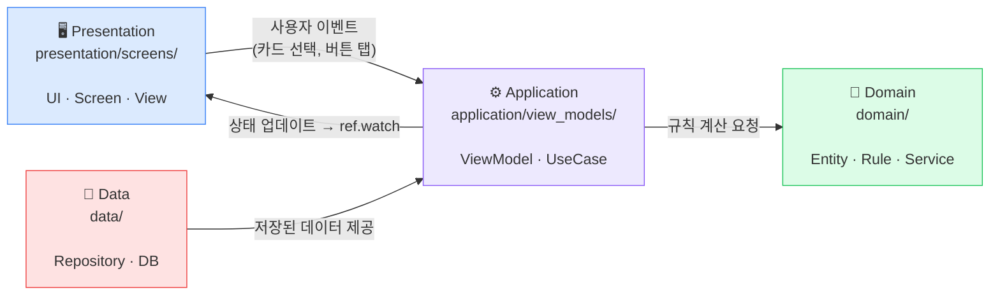

# 아키텍처

## 한 줄 요약

> 새 파일을 만들 때 "어디에 둘지 모르겠다"면 아래 질문 네 개 중 하나에 답하면 된다.

| 질문 | 폴더 |
|------|------|
| 새 **화면**이나 **위젯**인가? | `presentation/screens/` |
| **상태**를 들고 있거나 **흐름**을 조율하는가? | `application/view_models/` |
| **게임 규칙** 또는 **계산 로직**인가? | `domain/` |
| **저장/불러오기** (DB, 파일, 설정)인가? | `data/` |

---

## 레이어 다이어그램



**의존성 방향**: 바깥 레이어가 안쪽을 참조한다. 역방향은 금지.

```
presentation → application → domain ← data
```

---

## 레이어별 설명

### Presentation — `lib/presentation/screens/`

화면을 그리고 사용자 입력을 받는다. **로직은 없다.**

여기에 두는 이유: Flutter 위젯이기 때문이다. `ref.watch`로 상태를 읽고, 버튼을 누르면 ViewModel 메서드를 호출할 뿐이다. 3줄 이상의 조건문이 생기면 ViewModel로 옮긴다.

```
lib/presentation/
└── screens/
    ├── battle_screen.dart      # 전투 화면 (손패·몬스터·HP 표시)
    ├── map_screen.dart         # 스테이지 맵 (1 → 2 → 3 → Boss)
    ├── reward_screen.dart      # 전투 후 카드 보상 선택
    └── widgets/
        ├── card_widget.dart    # 개별 카드 UI
        └── monster_widget.dart # 몬스터 HP·상태이상 표시
```

---

### Application — `lib/application/view_models/`

화면이 필요한 상태를 들고, Domain 레이어의 규칙을 조율한다.

여기에 두는 이유: Riverpod `Notifier`로 상태를 관리하기 때문이다. Presentation이 직접 Domain을 호출하면 화면마다 로직이 흩어진다. ViewModel이 중간에서 조율하면 Presentation은 상태만 구독하면 된다.

```
lib/application/
└── view_models/
    ├── battle_provider.dart    # 전투 상태 (턴·에너지·손패·HP)
    ├── map_provider.dart       # 현재 스테이지·런 진행
    └── reward_provider.dart    # 보상 카드 후보·선택 처리
```

**규칙**
- 파일명은 `*_provider.dart`
- `BuildContext`를 인자로 받지 않는다
- `ref.watch`는 `build()` 안에서만 사용한다
- `views/` 또는 `screens/`를 import하지 않는다

---

### Domain — `lib/domain/`

게임의 핵심 규칙과 데이터 구조가 모인다. **Flutter도, Riverpod도 없는 순수 Dart**다.

여기에 두는 이유: 게임 규칙은 UI나 저장 방식이 바뀌어도 변하지 않아야 한다. 순수 Dart로 격리하면 Flutter 없이도 테스트할 수 있고, 규칙이 여러 곳에 흩어지지 않는다.

```
lib/domain/
├── card.dart               # Card 엔티티 (이름·비용·효과 타입)
├── character.dart          # 플레이어 상태 (HP·방어도·덱)
├── monster.dart            # 몬스터 엔티티 (HP·공격 패턴)
├── relic.dart              # 유물 엔티티 (패시브 효과)
├── battle_engine.dart      # 전투 계산 — 데미지·상태이상 공식
└── enums/
    ├── card_type.dart      # Attack / Defense / Special
    └── status_effect.dart  # Vulnerable / Weak
```

**핵심 공식 (모두 이 레이어에 구현)**

```dart
monsterHp     = 20 + (stage * 10)
monsterAttack =  8 + (stage *  2)
vulnerableMul = 1.5   // 받는 데미지 배율
weakMul       = 0.75  // 주는 데미지 배율 (floor 적용)
```

---

### Data — `lib/data/`

영속 데이터를 저장하고 불러온다. 현재는 `SharedPreferences`만 사용한다.

여기에 두는 이유: 저장 로직이 Domain이나 ViewModel에 섞이면 나중에 저장소를 바꿀 때 (예: Hive, SQLite) 코드 전체를 뒤져야 한다. Repository 패턴으로 분리하면 저장소가 바뀌어도 이 파일만 교체하면 된다.

```
lib/data/
└── game_repository.dart    # XP·레벨·해금 카드/유물 목록 저장·불러오기
```

**저장 대상**: 런이 끝난 후 영구적으로 남는 데이터만 저장한다.

| 저장 O | 저장 X |
|--------|--------|
| 플레이어 XP, 레벨 | 현재 턴의 손패 |
| 해금된 카드·유물 목록 | 진행 중인 전투 상태 |

---

## 전체 디렉토리 구조

```
lib/
├── main.dart
├── presentation/
│   └── screens/        # Presentation — Flutter 위젯
├── application/
│   └── view_models/    # Application  — Riverpod 프로바이더
├── domain/             # Domain       — 순수 Dart 게임 규칙
└── data/               # Data         — SharedPreferences 영속화

test/
├── domain/             # 단위 테스트 (커버리지 ≥ 80%)
│   ├── card_test.dart
│   ├── character_test.dart
│   ├── monster_test.dart
│   └── battle_engine_test.dart
├── application/        # ViewModel 테스트 (커버리지 ≥ 70%)
│   ├── battle_provider_test.dart
│   └── map_provider_test.dart
└── data/
    └── game_repository_test.dart
```
