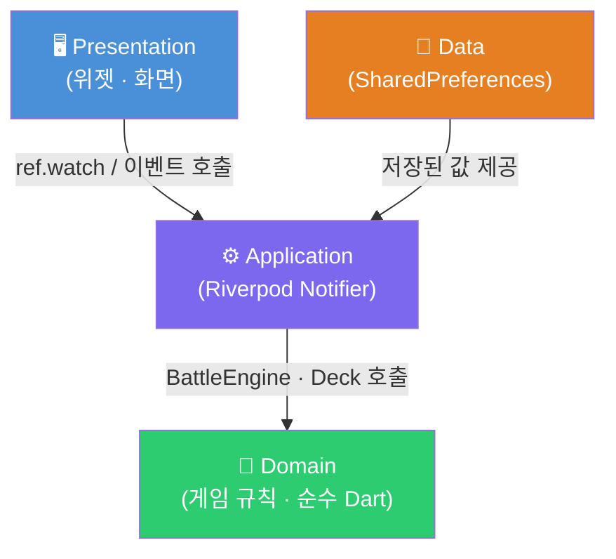

# architecture.md — 아키텍처 설계 문서

**버전**: 1.0 | **날짜**: 2026-05-19

> 이 문서만 보고 60초 안에 앱 구조를 설명할 수 있도록 작성되었습니다.

---

## 4계층 구조 한 줄 정의

| 계층 | 폴더 | 한 줄 책임 |
|------|------|-----------|
| **Presentation** | `lib/presentation/` | 화면에 그림을 그리고, 버튼 입력을 아래로 전달한다 |
| **Application** | `lib/application/` | "무슨 일이 일어났는지"를 듣고, 게임 규칙을 호출해 상태를 바꾼다 |
| **Domain** | `lib/domain/` | 데미지 계산·카드 효과·덱 셔플 등 순수 게임 규칙만 담당한다 |
| **Data** | `lib/data/` | XP·레벨·해금 카드를 기기에 저장하고 불러온다 |

> **의존 방향**: `Presentation → Application → Domain ← Data`  
> 상위 계층은 하위 계층만 알 수 있다. 역방향 임포트는 금지한다.

---

## 계층 간 의존성 흐름 (Mermaid)



---

## 핵심 기능 3가지의 계층 흐름

| 핵심 기능 | Presentation | Application | Domain | Data |
|-----------|-------------|-------------|--------|------|
| **1. 전투 시스템** | 카드를 드래그해 `playCard()` 호출 | `BattleProvider`가 명령 수신·상태 갱신 | `BattleEngine`이 데미지·상태이상 계산 | — |
| **2. 카드 / 덱 관리** | 핸드 카드 위젯 표시 | `DeckProvider`가 드로우·셔플 조율 | `Deck`이 순수 로직 처리 | — |
| **3. 로그라이크 런 진행** | 스테이지 지도·결과 화면 표시 | `RunProvider`가 스테이지 전환·XP 산정 | `Player` · `Monster` 엔티티 상태 계산 | `LocalStorage`에 XP·레벨·해금 카드 저장 |

---

## 디렉토리 트리

```
lib/
├── presentation/              # 화면에 그리는 위젯만
│   ├── battle/
│   │   ├── battle_screen.dart
│   │   └── widgets/
│   │       ├── card_widget.dart
│   │       ├── hand_widget.dart
│   │       └── monster_widget.dart
│   ├── map/
│   │   └── map_screen.dart
│   └── shared/
│       └── hp_bar_widget.dart
│
├── application/               # 상태 소유 + 명령 처리 (Riverpod Notifier)
│   ├── battle_provider.dart
│   ├── deck_provider.dart
│   └── run_provider.dart
│
├── domain/                    # 게임 규칙 순수 Dart (Flutter 임포트 없음)
│   ├── entities/
│   │   ├── card.dart
│   │   ├── monster.dart
│   │   └── player.dart
│   ├── battle_engine.dart
│   ├── deck.dart
│   └── status_effect.dart
│
├── data/                      # 저장·불러오기
│   └── local_storage.dart
│
└── main.dart
```

---

## 교수님 Q&A 방어 핵심 논리

**Q. 왜 4계층으로 나눴나요?**
> 게임 규칙(Domain)이 화면(Presentation)이나 저장소(Data)와 섞이면 테스트가 불가능해집니다.
> `flutter test`로 데미지 계산을 화면 없이 검증하려면 Domain이 독립적이어야 합니다.

**Q. Riverpod은 어느 계층인가요?**
> Application 계층입니다. `Notifier`가 ViewModel 역할을 하며,
> Domain의 `BattleEngine`을 호출하고 결과를 상태로 저장합니다.

**Q. Data 계층이 Domain을 몰라도 되나요?**
> 네. Data는 단순 키-값 저장소(SharedPreferences)이고,
> 비즈니스 의미(XP가 뭔지)는 Application이 해석합니다.

---

## 관련 ADR

| ADR | 제목 |
|-----|------|
| [ADR-0001](decisions/ADR-0001-mobile-platform.md) | 플랫폼 — Flutter |
| [ADR-0002](decisions/ADR-0002-architecture-mvvm.md) | 아키텍처 — Layered Architecture |
| [ADR-0003](decisions/ADR-0003-state-management-riverpod.md) | 상태관리 — Riverpod |
| [ADR-0004](decisions/ADR-0004-persistence-local.md) | 영속성 — 로컬 우선 |
