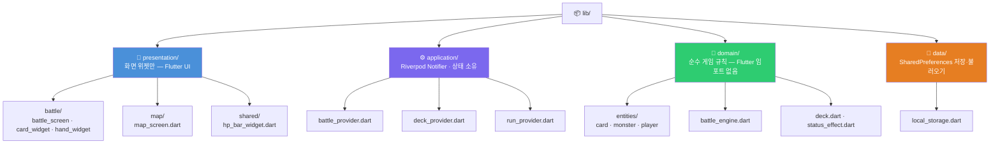
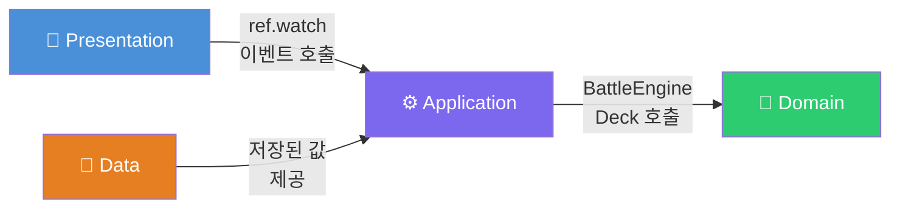

# Slay the Flutter
## 아키텍처 설계 발표

Flutter 덱빌딩 로그라이크 카드 게임

**발표자**: kang3019 | **날짜**: 2026-05-23

---

## 목차

| # | 주제 |
|---|------|
| 1 | 왜 이 프레임워크를 선택했는가? |
| 2 | ADR 결정 60초 요약 |
| 3 | 프로젝트 디렉토리 구조 |
| 4 | 새 화면을 추가하려면 어디에 파일을 만드는가? |
| 5 | API 호출은 어느 레이어에서 일어나는가? |
| 6 | 빌드가 실패하면 어디부터 보는가? |
| 7 | git clone 후 한 줄 실행 (인수인계) |

---

## 1. 왜 Flutter인가? — 대안 비교

| 선택지 | 치명적 문제 |
|--------|-------------|
| React Native | JS Bridge 오버헤드 · 카드 애니메이션 커스텀 제약 |
| Android (Kotlin) | iOS 지원 불가 — 양 플랫폼 요구 사항 미충족 |
| iOS (Swift) | Android 지원 불가 + macOS 개발 환경 필수 |
| Kotlin Multiplatform | UI는 플랫폼별 별도 구현 → 1인 단기 개발에 부적합 |
| ✅ **Flutter** | 단일 코드베이스로 Android·iOS 동시 빌드 |

---

## 1. 왜 Flutter인가? — 최종 근거

### 3가지 결정적 이유

> **① 단일 코드베이스**
> 한 번 작성해 Android와 iOS를 동시에 커버한다.
> 1인 개발에서 공수를 절반으로 줄이는 핵심 결정이다.

> **② 독자 렌더링 엔진**
> 네이티브 컴포넌트에 의존하지 않아
> 카드 애니메이션과 커스텀 레이아웃을 자유롭게 구현할 수 있다.

> **③ Riverpod과의 자연스러운 결합**
> `Notifier` / `AsyncNotifier` API가 Application 계층 ViewModel 역할을
> 별도 글루 코드 없이 즉시 수행한다.

---

## 2. ADR 결정 60초 요약

| ADR | 결정 | 핵심 근거 |
|-----|------|-----------|
| **0001** 플랫폼 | **Flutter** | 단일 코드로 Android·iOS 동시 지원 + Hot Reload |
| **0002** 아키텍처 | **4-Layer Layered Architecture** | 게임 규칙(Domain)을 UI 없이 테스트하기 위해 분리 |
| **0003** 상태관리 | **Riverpod** | `BuildContext` 없이 Provider 참조 → Layered Architecture 원칙 보장 |
| **0004** 영속성 | **Local-First** | 서버 비용 0원 · 오프라인 완전 동작 · 데이터 규모 작음 |

> **모든 결정의 공통 기준**:
> "테스트 가능성"과 "1인 단기 개발 현실성"이다.
> 이 두 축에서 Flutter + Layered Architecture + Riverpod + Local-First는 가장 일관된 선택이었다.

---

## 3. 프로젝트 디렉토리 구조



---

## 3. 의존성 방향 — 핵심 규칙



> **금지 규칙**: 역방향 임포트는 절대 허용하지 않는다.
> `Domain`이 `Presentation`을 알게 되는 순간 테스트는 불가능해진다.

---

## 4. 새 화면 추가 — 어디에 파일을 만드는가?

보상 화면(Reward Screen)을 예시로 설명한다.

```
lib/
├── presentation/          ← ① 화면 파일 생성
│   └── reward/
│       ├── reward_screen.dart     # Widget 코드만 작성
│       └── widgets/
│           └── reward_card.dart
│
├── application/           ← ② 상태가 필요하면 Provider 추가
│   └── reward_provider.dart       # Notifier 작성
│
└── domain/                ← ③ 새 게임 규칙이 있으면 Entity 추가
    └── entities/
        └── reward.dart
```

> **핵심 원칙**:
> `presentation/`에는 위젯 코드만 들어간다.
> 3줄 이상의 조건 로직은 `application/`으로 내린다.
> `presentation/`이 `domain/`을 직접 임포트하면 **아키텍처 위반**이다.

---

## 5. API 호출은 어느 레이어인가?

```
사용자 입력 (카드 드래그)
         │
         ▼
┌──────────────────────────────────┐
│  📱 Presentation                  │
│  ref.read(battleProvider         │  ← 이벤트만 전달
│            .notifier).playCard() │     비즈니스 로직 없음
└──────────────┬───────────────────┘
               │
               ▼
┌──────────────────────────────────┐
│  ⚙️ Application                   │
│  battle_provider.dart            │  ← 여기서 모든 외부 호출
│                                  │     BattleEngine.calculate()
│  run_provider.dart               │     localStorage.saveLevel()
└──────────────┬───────────────────┘
               │
               ▼
┌──────────────────────────────────┐
│  📐 Domain (순수 계산)            │
│  BattleEngine · Deck             │  ← 외부 의존 없음
│                                  │     flutter test로 단독 검증 가능
└──────────────────────────────────┘
```

> **결론**: SharedPreferences(저장소) 접근은 `application/` Provider 안에서만 일어난다.
> Domain은 저장소를 모르고, Presentation은 데이터 출처를 모른다.

---

## 6. 빌드 실패 시 — 체크리스트 (순서 엄수)

```bash
# Step 1 — 정적 분석: 컴파일 오류·임포트 문제 확인 (가장 빠름)
flutter analyze

# Step 2 — 환경 문제: SDK·JDK·에뮬레이터 상태 확인
flutter doctor -v

# Step 3 — 의존성·캐시 초기화
flutter clean && flutter pub get

# Step 4 — 테스트로 게임 로직 회귀 검증
flutter test --reporter=expanded

# Step 5 — 그래도 안 되면 IDE 캐시 초기화
# Android Studio → File → Invalidate Caches / Restart
```

> **황금 규칙**:
> 에러 메시지는 항상 **맨 위 첫 번째 오류**부터 읽는다.
> 스크롤을 내리지 말고, 터미널 상단을 먼저 확인한다.

---

## 7. git clone 후 한 줄 실행 — 인수인계

```bash
git clone https://github.com/kang3019/slay-the-flutter.git \
  && cd slay-the-flutter \
  && flutter pub get \
  && flutter run
```

### 실행 전 사전 조건 확인

| 항목 | 확인 명령어 | 요구 버전 |
|------|-------------|-----------|
| Flutter SDK | `flutter --version` | 3.x (^3.9.2) |
| JDK | `java -version` | 17 이상 |
| 기기 연결 | `flutter devices` | 1개 이상 |
| 환경 이상 없음 | `flutter doctor` | 모든 항목 ✓ |

> 에뮬레이터가 없다면:
> Android Studio → **Device Manager → Create Virtual Device** 후 재실행

---

## 정리 — 한 장으로 보는 아키텍처 결정

| 질문 | 답 |
|------|----|
| 왜 Flutter? | 단일 코드베이스 + Riverpod Layered Architecture 자연 결합 |
| ADR 핵심 | Flutter · 4-Layer Layered Architecture · Riverpod · Local-First |
| 새 화면 위치 | `lib/presentation/<기능>/` |
| API 호출 레이어 | `application/` Provider 내부 |
| 빌드 실패 첫 번째 | `flutter analyze` |
| 한 줄 실행 | `git clone ... && flutter pub get && flutter run` |

---

# Q & A

> **"이 구조에서 가장 자랑스러운 결정은?"**

`domain/`을 순수 Dart로 유지한 것이다.

`flutter test`로 화면 없이 데미지 계산과 덱 로직을 검증할 수 있다.
TDD를 실제로 가능하게 만드는 유일한 전제 조건이었고,
그것이 이 아키텍처 전체의 설계 이유다.
