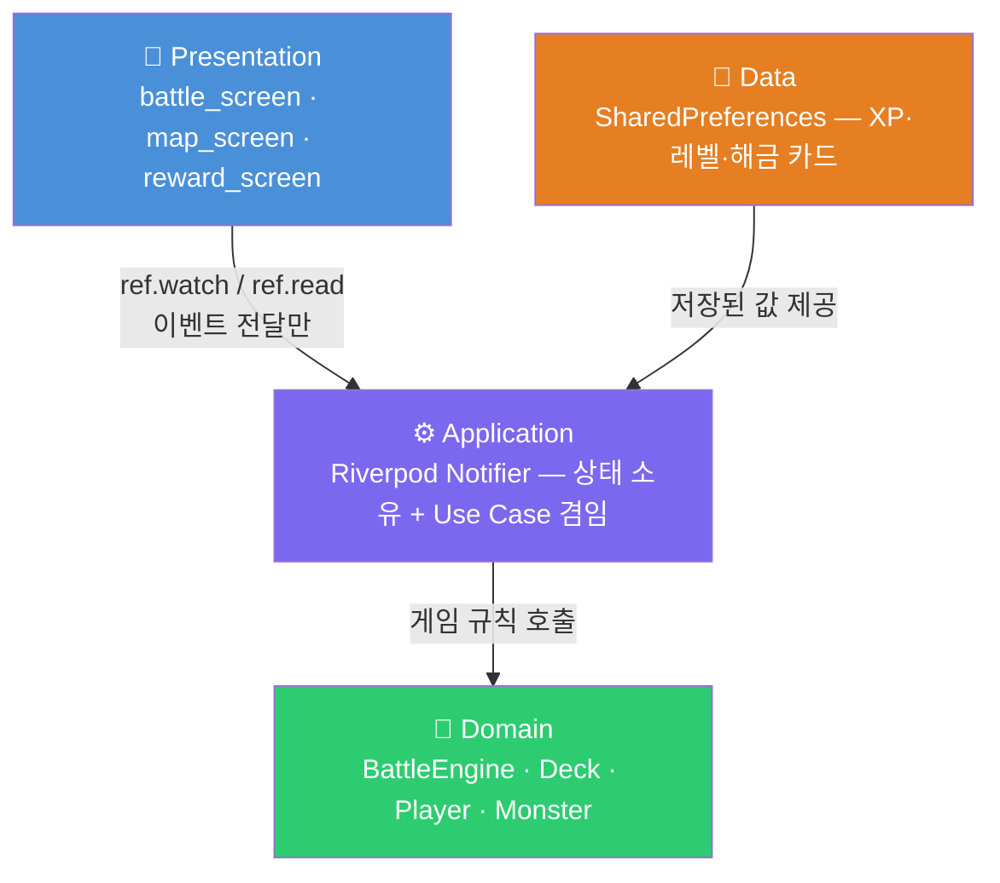

# Slay the Flutter
## 전략적 카드 선택과 끊임없는 도전의 덱빌딩 로그라이크

Flutter · Riverpod · 4-Layer Layered Architecture

**발표자**: kang3019 | **2026-05-23**

<!--
안녕하세요. Slay the Flutter 프로젝트를 발표할 kang3019입니다.
이 게임은 매 런마다 카드를 골라 덱을 구성하고, 스테이지를 돌파하는 모바일 덱빌딩 로그라이크입니다.
사용자가 얻는 핵심 가치는 두 가지입니다.
첫째, 매 런마다 다른 덱을 구성하는 '이번엔 어떤 빌드로 가볼까'라는 반복 플레이 동기.
둘째, 런이 끝날 때마다 XP가 쌓여 새 카드와 유물이 영구 해금되는 메타 성장 구조입니다.
짧게 말하면, 플레이할수록 선택지가 넓어지는 게임입니다.
-->

---

## 프로젝트 개요

| 항목 | 내용 |
|------|------|
| **플랫폼** | Android / iOS |
| **장르** | 턴제 덱빌딩 로그라이크 카드 게임 |
| **핵심 루프** | 런 시작 → 카드 전투 → 보상 선택 → 반복 → 런 종료 |
| **메타 성장** | XP 누적 → 레벨업 → 카드·유물 영구 해금 |
| **저장 방식** | 로컬 (SharedPreferences) — 오프라인 완전 동작 |

### 핵심 게임 공식

```
몬스터 HP    = 20 + (스테이지 × 10)
몬스터 공격력 = 8  + (스테이지 × 2)
취약 피해     = 기본 × 1.5   |   약화 피해 = 기본 × 0.75
에너지/턴 = 3   |   드로우/턴 = 5
```

<!--
프로젝트 개요를 한 슬라이드로 정리했습니다.
플랫폼은 Flutter 단일 코드베이스로 Android와 iOS를 동시에 지원합니다.
핵심 루프는 '런 시작 → 전투 → 보상'의 반복이고,
런이 끝나면 XP가 SharedPreferences에 영구 저장돼 다음 런에서 새 카드가 등장합니다.
게임 공식은 SPECS.md에 상수로 관리되고 있어,
밸런스 조정이 필요할 때 숫자 한 줄만 바꾸면 됩니다.
-->

---

## 기술 스택 및 ADR 결정 — 60초 요약

### 왜 Flutter인가?

| 대안 | 탈락 이유 |
|------|-----------|
| React Native | JS Bridge 오버헤드 · 카드 애니메이션 커스텀 제약 |
| Android / iOS 단독 | 양 플랫폼 요구 미충족 · 공수 2배 |
| Kotlin Multiplatform | UI 레이어 플랫폼별 별도 구현 → 1인 단기 개발에 부적합 |
| ✅ **Flutter** | 단일 코드베이스 · 독자 렌더링 엔진 · Hot Reload |

### 왜 Riverpod인가?

| 대안 | 탈락 이유 |
|------|-----------|
| Provider | `BuildContext` 없이 다른 Provider 참조 불가 |
| Bloc/Cubit | 카드 한 장 효과에도 Event→State 변환 코드가 과도하게 장황 |
| GetX | 전역 싱글톤 → 테스트 격리 불가, 컴파일 타임 안전성 없음 |
| ✅ **Riverpod** | `BuildContext` 없이 참조 · 테스트 격리 · `AsyncValue<T>` 타입 안전 |

<!--
기술 선택은 두 가지 기준으로 결정했습니다. 테스트 가능성, 그리고 1인 단기 개발 현실성입니다.
Flutter는 단일 코드베이스로 두 플랫폼을 커버하고, 독자 렌더링 엔진 덕분에 카드 UI를 자유롭게 구현할 수 있습니다.
Riverpod은 BuildContext 없이 Application 계층에서 Provider를 참조할 수 있어 Layered Architecture 원칙을 지킬 수 있었습니다.
Provider는 BuildContext 의존, Bloc은 보일러플레이트 과다, GetX는 테스트 격리 불가라는 이유로 탈락했습니다.
이 모든 결정은 docs/decisions/ 폴더의 ADR-0001~0004에 근거와 함께 기록되어 있습니다.
-->

---

## 경량화된 계층형 아키텍처



> **의존 방향**: `Presentation → Application → Domain ← Data`
> 역방향 임포트는 코드 리뷰에서 즉시 차단한다.

<!--
아키텍처는 Clean Architecture를 참고한 4계층 Layered Architecture입니다.
단, 프로젝트 규모를 고려해 Use Case 레이어를 별도로 두지 않고,
Application 계층의 Riverpod Notifier가 ViewModel과 Use Case를 함께 담당합니다.
이 선택의 핵심 근거는 테스트 가능성입니다.
Domain이 순수 Dart로 독립되어 있기 때문에, 화면을 띄우지 않고 flutter test 명령 하나로
데미지 계산과 덱 로직을 검증할 수 있습니다.
의존성은 항상 위에서 아래로 단방향입니다. Presentation이 Domain을 직접 import하면 아키텍처 위반입니다.
-->

---

## 개발 및 운영 방어

| 질문 | 답 |
|------|----|
| **새 화면 추가 위치** | `lib/presentation/<기능>/` — Widget 코드만 작성 |
| **상태와 게임 규칙 위치** | 상태: `lib/application/` · 규칙: `lib/domain/` |
| **저장소 접근 위치** | `lib/data/local_storage.dart` — Application만 호출 |
| **빌드 실패 시** | `flutter analyze` → `flutter doctor` → `flutter clean && flutter pub get` |
| **git clone 후 실행** | `flutter pub get && flutter run` — 한 줄로 끝 |

### 한 줄 실행 (인수인계)

```bash
git clone https://github.com/kang3019/slay-the-flutter.git \
  && cd slay-the-flutter && flutter pub get && flutter run
```

> 상세 환경 설정은 **`docs/setup.md`** 에 5분 내 실행 가이드로 정리되어 있다.

<!--
인수인계 관점에서 이 구조가 왜 유지보수에 유리한지 설명하겠습니다.
새 화면이 필요하면 presentation/ 폴더에 파일 하나만 추가하면 됩니다. 다른 계층은 건드리지 않아도 됩니다.
상태와 게임 규칙은 각각 application/과 domain/에 격리되어 있어,
화면 디자인이 바뀌어도 게임 로직에 영향을 주지 않습니다.
빌드가 실패하면 먼저 flutter analyze로 정적 분석 오류를 확인하고,
환경 문제라면 flutter doctor, 캐시 문제라면 flutter clean 순으로 확인합니다.
git clone 이후에는 flutter pub get && flutter run 두 명령이면 바로 실행됩니다.
환경 설정 전체 가이드는 docs/setup.md에 정리되어 있습니다.
-->

---

## 마무리 및 향후 목표

### 현재까지 완료

- 4계층 아키텍처 설계 및 문서화 (ADR 4건)
- 게임 규칙 명세 (SPECS.md) 및 WBS·스프린트 계획 수립
- 개발 환경 설정 가이드 (docs/setup.md)

### 남은 구현 목표

| 단계 | 내용 |
|------|------|
| Phase 2 | Domain 엔티티 + BattleEngine 구현 (TDD 적용) |
| Phase 3 | Presentation UI + Application Provider 연결 |
| Phase 4 | 메타 진행 (XP·레벨업·해금) 구현 |
| Phase 5 | 전체 통합 테스트 · 커버리지 80% 달성 |

---

# Q & A

> **"이 구조에서 가장 중요하게 생각한 것은 무엇인가요?"**

Domain을 순수 Dart로 유지한 것.
`flutter test` 하나로 화면 없이 데미지 계산을 검증할 수 있고,
그것이 TDD를 실천 가능하게 만드는 유일한 전제 조건이었다.

<!--
발표를 마치겠습니다.
이 프로젝트의 모든 설계 결정은 '테스트 가능성'과 '1인 개발 현실성'이라는 두 기준에서 출발했습니다.
아키텍처 문서, ADR, 설정 가이드는 모두 docs/ 폴더에 정리되어 있습니다.
질문 받겠습니다.
-->
