<!-- _paginate: false -->
# Slay the Flutter
## 전략적 카드 선택과 끊임없는 도전의 덱빌딩 로그라이크

Flutter · Riverpod · 4-Layer Layered Architecture

**발표자**: 강민권, 김윤상 | **2026-05-25**

<!--
안녕하세요. Slay the Flutter 프로젝트를 발표할 kang3019입니다.
이 게임은 매 런마다 카드를 골라 덱을 구성하고 스테이지를 돌파하는 모바일 덱빌딩 로그라이크입니다.
사용자가 얻는 핵심 가치는 두 가지입니다.
첫째, 매 런마다 다른 덱을 구성하는 '이번엔 어떤 빌드로 가볼까'라는 반복 플레이 동기.
둘째, 런이 끝날 때마다 XP가 쌓여 새 카드와 유물이 영구 해금되는 메타 성장 구조입니다.
짧게 말하면, 플레이할수록 선택지가 넓어지는 게임입니다.
-->

---

## 프로젝트 개요

| 항목 | 내용 |
|------|------|
| **플랫폼** | Android / iOS (Flutter 단일 코드베이스) |
| **장르** | 턴제 덱빌딩 로그라이크 카드 게임 |
| **핵심 루프** | 런 시작 → 카드 전투 → 보상 선택 → 반복 → 런 종료 |
| **메타 성장** | XP 누적 → 레벨업 → 카드·유물 영구 해금 |
| **저장 방식** | 로컬 (SharedPreferences) — 오프라인 완전 동작 |

### 핵심 게임 공식 (SPECS.md 상수화)

| 공식 | 값 |
|------|----|
| 몬스터 HP | `20 + (스테이지 × 10)` |
| 몬스터 공격력 | `8 + (스테이지 × 2)` |
| 취약 피해 배율 | `× 1.5` |
| 약화 피해 배율 | `× 0.75` |
| 에너지 / 드로우 per 턴 | `3 / 5` |

<!--
프로젝트 개요입니다.
Flutter 단일 코드베이스로 Android와 iOS를 동시에 지원합니다.
핵심 루프는 런 시작 → 전투 → 보상의 반복이고, 런 종료 시 XP가 로컬에 영구 저장됩니다.
게임 공식은 모두 SPECS.md에 상수로 관리되어 있어, 밸런스 조정 시 숫자 한 줄만 바꾸면 됩니다.
-->

---

## ADR-0001 — 왜 Flutter인가?

| 대안 | 탈락 이유 |
|------|-----------|
| React Native | JS Bridge 오버헤드 · 카드 애니메이션 커스텀 제약 |
| Android (Kotlin) 단독 | iOS 지원 불가 — 양 플랫폼 요구 미충족 |
| iOS (Swift) 단독 | Android 지원 불가 + macOS 개발 환경 필수 |
| Kotlin Multiplatform | UI 레이어 플랫폼별 별도 구현 → 1인 단기 개발에 부적합 |
| ✅ **Flutter** | 단일 코드베이스 · 독자 렌더링 엔진 · Hot Reload |

### 결정 근거

> **① 단일 코드베이스** — Android·iOS 동시 커버, 1인 개발 공수 절반
> **② 독자 렌더링 엔진** — 네이티브 컴포넌트 불필요, 카드 UI·애니메이션 자유롭게 구현
> **③ Hot Reload** — 짧은 개발 사이클에서 UI 이터레이션 속도 극대화

<!--
[대본] ADR-0001 — 왜 Flutter인가?
"두 가지 이유입니다.
첫째, Android와 iOS를 혼자 개발해야 하는데 Flutter는 코드베이스 하나로 둘 다 커버됩니다.
네이티브 단독 개발은 한 플랫폼만 되니 요구 사항 자체를 충족하지 못합니다.
둘째, 카드 드래그나 애니메이션 같은 커스텀 UI를 구현해야 하는데,
Flutter는 독자 렌더링 엔진을 써서 네이티브 컴포넌트에 의존하지 않습니다.
React Native는 JS Bridge를 거쳐야 해서 애니메이션 커스텀에 제약이 생깁니다."
-->

---

## ADR-0002 — 아키텍처: 경량화된 계층형 구조

<div style="display: flex; justify-content: center; align-items: center; margin-top: 20px;">
  
</div>

> **의존 방향**: `Presentation → Application → Domain ← Data`
> Clean Architecture 참고, Use Case 레이어 생략 — 1인 개발 규모에서 오버엔지니어링 판단

<!--
[대본] ADR-0002 — 왜 이 아키텍처인가?
"게임 로직이 UI 코드와 섞이면 테스트를 작성할 수 없습니다.
데미지 계산 하나 테스트하려고 화면을 띄워야 하면 TDD 자체가 불가능해집니다.
Clean Architecture를 참고해 4계층으로 분리했고,
1인 단기 개발이라 Use Case 레이어는 오버엔지니어링이라 판단해 생략했습니다.
그 역할을 Application 계층 Notifier가 함께 담당합니다.
의존성은 항상 단방향입니다. Presentation이 Domain을 직접 import하면 즉시 차단합니다."
-->

---

## ADR-0003 — 왜 Riverpod인가?

| 대안 | 탈락 이유 |
|------|-----------|
| Provider | `BuildContext` 없이 다른 Provider 참조 불가 → 계층 분리 원칙 위반 |
| Bloc/Cubit | 카드 한 장 효과에도 Event→State 변환 코드가 과도하게 장황 |
| GetX | 전역 싱글톤 → 테스트 격리 근본적 불가 · 컴파일 타임 안전성 없음 |
| ✅ **Riverpod** | `BuildContext` 없이 참조 · 테스트 격리 · `AsyncValue<T>` 타입 안전 |

### 계층 분리가 가능한 이유

```dart
// Application 계층 Notifier — Flutter 위젯 트리 없이 단독 테스트 가능
class BattleNotifier extends Notifier<BattleState> {
  @override
  BattleState build() => BattleState.initial();
  void playCard(Card card) { /* BattleEngine 호출 */ }
}
// 테스트 — BuildContext, MediaQuery 불필요
setUp(() => container = ProviderContainer());
```

<!--
상태 관리 선택 근거입니다.

코드 설명 스크립트:
"다른 라이브러리는 Provider를 읽으려면 BuildContext, 즉 Flutter 화면이 있어야 합니다.
그러면 Application 계층이 화면에 묶여버려요.
Riverpod은 ProviderContainer 하나만으로 화면 없이 Application 계층을 테스트할 수 있어서
계층 분리가 실제로 성립합니다. 코드에서 보이듯 Flutter import가 전혀 없습니다."
-->

---

## ADR-0004 — 영속성 전략: 무엇으로 저장할 것인가?

> 게임을 종료했다가 다시 켜도 레벨·XP·해금 카드 목록이 유지되어야 한다.

| 대안 | 탈락 이유 |
|------|-----------|
| Firebase Firestore | 인터넷 의존 · 무료 티어 제한 · 계정 시스템 필요 — 게임 규모 대비 과함 |
| Firebase Realtime DB | 동일하게 인터넷 의존 — 오프라인 플레이 요구 미충족 |
| SQLite (drift/sqflite) | 저장 데이터가 키-값 수준 — 스키마 설계·마이그레이션 비용 과도 |
| ✅ **SharedPreferences + JSON** | 로컬 · 오프라인 · 무료 · 설정 불필요 → 요구 사항에 정확히 부합 |

### 저장 대상

| 키 | 타입 | 설명 |
|----|------|------|
| `player_level` | `int` | 현재 레벨 |
| `player_xp` | `int` | 누적 XP |
| `unlocked_cards` | `List<String>` | 해금된 카드 ID 목록 |

<!--
[대본] ADR-0004 — 왜 SharedPreferences인가?
"세 가지 요구 사항이 있었습니다. 오프라인 동작, 서버 비용 없음, 단순한 데이터 구조.
Firebase는 인터넷 연결과 계정 시스템이 필요해서 오프라인 요구를 충족하지 못합니다.
SQLite는 저장 데이터가 레벨, XP, 해금 카드 목록 세 가지뿐인데 스키마 설계까지 하면 과도합니다.
SharedPreferences는 OS가 기본 제공하는 키-값 저장소라 설정이 전혀 없고,
서버도 인터넷도 필요 없어서 세 요구 사항에 정확히 맞습니다."
-->

---

## 개발 및 운영 방어

| 질문 | 답 |
|------|----|
| **새 화면 추가 위치** | `lib/presentation/<기능>/` — Widget 코드만 작성 |
| **상태 · 게임 규칙 위치** | 상태 → `lib/application/` · 규칙 → `lib/domain/` |
| **저장소 접근 위치** | `lib/data/local_storage.dart` — Application만 호출 |
| **빌드 실패 시** | `flutter analyze` → `flutter doctor -v` → `flutter clean && flutter pub get` |
| **git clone 후 실행** | `flutter pub get && flutter run` — 한 줄로 끝 |

```bash
git clone https://github.com/kang3019/slay-the-flutter.git \
  && cd slay-the-flutter && flutter pub get && flutter run
```

> 환경 설정 상세 → **`docs/setup.md`** (5분 내 실행 가이드)

<!--
───────────────────────────────────────────
[대본] Q&A 방어 스크립트
───────────────────────────────────────────

Q. 새 화면을 추가하려면 어디에 파일을 만들어야 하나?
A. lib/presentation/<기능>/ 폴더 안에 Widget 파일만 추가하면 됩니다.
   예를 들어 상점 화면을 추가한다면 lib/presentation/shop/shop_screen.dart 하나만 만들면 됩니다.
   Application, Domain, Data 계층은 건드리지 않아도 됩니다.
   계층이 분리되어 있으니까 화면 파일만 추가해도 게임 규칙에는 영향이 없습니다.

Q. 상태 흐름과 핵심 규칙은 어디서 관리하나?
A. 상태는 lib/application/ — Riverpod Notifier가 들고 있습니다.
   게임 규칙(데미지 계산, 덱 로직)은 lib/domain/ — 순수 Dart 코드로만 존재합니다.
   Presentation은 ref.watch로 Application 상태를 구독하고,
   Application이 Domain의 BattleEngine을 호출하는 단방향 흐름입니다.

Q. API 또는 DB는 어디에서 접근하나?
A. lib/data/local_storage.dart 한 파일에서만 저장소에 접근합니다.
   호출 주체는 Application 계층뿐입니다. Presentation과 Domain은 저장소를 직접 몰라도 됩니다.
   이 프로젝트는 외부 API 없이 SharedPreferences(로컬 키-값 저장소)만 씁니다.
   만약 나중에 외부 API가 생긴다면 Data 계층에 repository 파일을 추가하고,
   Application이 그걸 호출하는 구조로 확장하면 됩니다.

Q. API 호출은 어느 레이어에서 일어나는가?
A. Data 계층이 저장소를 직접 읽고 쓰고,
   Application 계층이 Data를 호출해서 결과를 상태에 반영합니다.
   즉, 실제 I/O는 Data, 그 결과를 게임 흐름에 연결하는 건 Application입니다.
   Presentation은 저장소 존재 자체를 모릅니다.

Q. 빌드가 실패하면 어디부터 봐야 하나?
A. 세 단계 순서로 확인합니다.
   1) flutter analyze — 코드 문법·타입 오류 확인
   2) flutter doctor -v — Flutter SDK, Android/iOS 환경 문제 확인
   3) flutter clean && flutter pub get — 빌드 캐시 초기화 후 의존성 재설치
   대부분은 3번으로 해결됩니다. analyze 경고가 0건이어야 커밋 가능하도록 규칙을 정해뒀습니다.

Q. git clone 후 한 줄 명령으로 실행되는가?
A. 네, flutter pub get && flutter run 두 명령이면 바로 실행됩니다.
   서버도, 계정도, 별도 설정도 필요 없습니다.
   SharedPreferences가 OS가 기본 제공하는 저장소라 설치·설정이 전혀 없고,
   오프라인 상태에서도 완전히 동작합니다.
───────────────────────────────────────────
-->

---

## 현재 진행 현황 및 향후 목표

### ✅ 완료 (Phase 1 — 기반)

- 4계층 아키텍처 설계 및 문서화 (ADR 4건, `docs/decisions/`)
- 게임 규칙 명세 (`SPECS.md`) · WBS · 스프린트 계획 수립
- 개발 환경 설정 가이드 (`docs/setup.md`)
- LLM 협업 검토 기록 (`docs/llm-wiki/`)

### 🔜 남은 목표

| 단계 | 내용 | 완료 기준 |
|------|------|-----------|
| **Phase 2** | Domain 엔티티 + BattleEngine 구현 | TDD 적용 · 커버리지 ≥ 80% |
| **Phase 3** | Presentation UI + Application Notifier 연결 | 전투 화면 동작 |
| **Phase 4** | 메타 진행 (XP · 레벨업 · 해금) 구현 | 로컬 저장·불러오기 |
| **Phase 5** | 전체 통합 테스트 · 릴리즈 빌드 | `flutter analyze` 경고 0건 |

<!--
현재 Phase 1 기반 작업이 완료된 상태입니다.
아키텍처 설계, 문서화, 개발 환경 세팅이 끝났고
다음은 Domain 계층의 BattleEngine부터 TDD로 구현합니다.
-->

---

<!-- _paginate: false -->
# 감사합니다

> 설계 결정의 모든 근거는 `docs/decisions/` ADR 4건에 기록되어 있습니다.

**질문 있으시면 받겠습니다.**

<!--
발표를 마치겠습니다.
이 프로젝트의 모든 설계 결정은 '테스트 가능성'과 '1인 개발 현실성'이라는 두 기준에서 출발했습니다.
질문 받겠습니다.
-->
